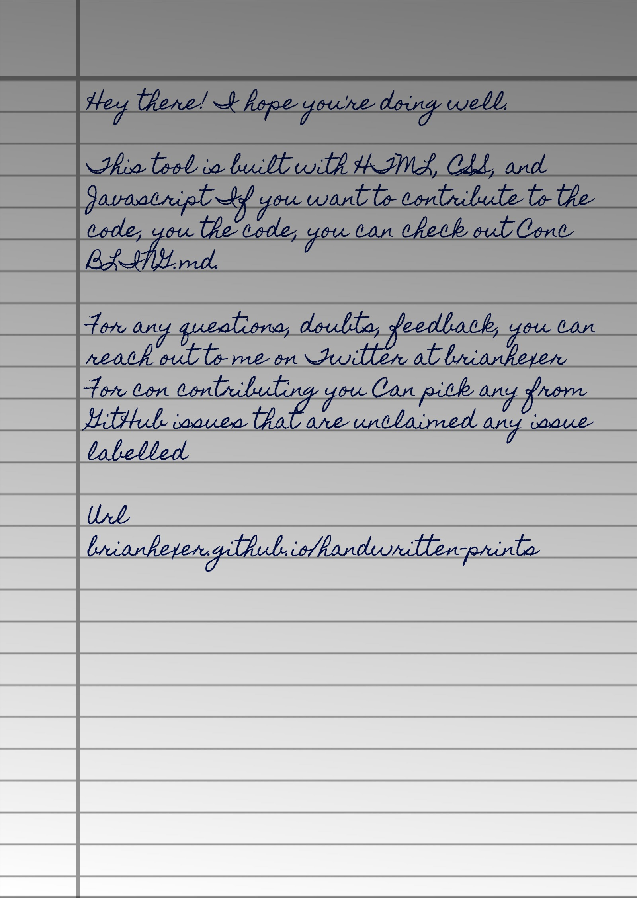

<p align="center">
 
<br/><b><a href="https://brianhexer.github.io/handwritten-prints/">Handwritten Prints</a></b><br/><br/><br/><br/> A powerful tool that converts text to an image that looks like handwriting. Perfect for creating natural-looking handwritten documents!

</p>

## 🌠 Output



## 🤗 Contributing

Checkout [Contribution Guide](CONTRIBUTING.md) for local setup and contribution guide.

## 📚 Libraries used

- [html2canvas](https://github.com/niklasvh/html2canvas) - Turns DOM into Canvas.
- [jsPDF](https://github.com/MrRio/jsPDF) - To generate PDF from images.
- [cypress](https://github.com/cypress-io/cypress) - Testing Library
- [serve](https://github.com/zeit/serve) - Start local server

---

## 🚀 Getting Started

To get started, clone the repository and install dependencies:

```bash
git clone https://github.com/brianhexer/handwritten-prints.git
cd handwritten-prints
npm install
npm run dev
```

Then open your browser to `http://localhost:3000`

## 📝 License

This project is licensed under the MIT License - see the [LICENSE](LICENSE) file for details.

Enjoy creating handwritten documents! ✨
